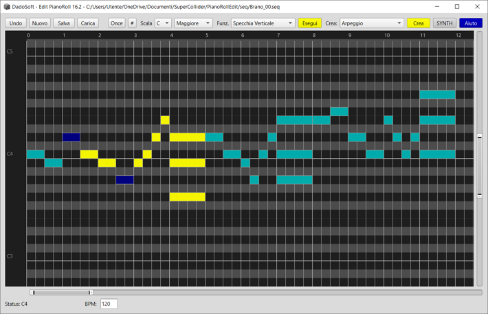
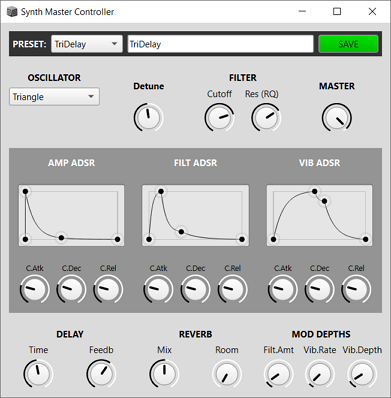
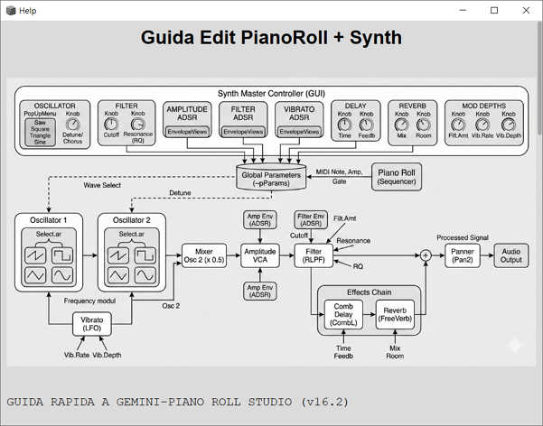

# Editor Piano Roll per note con synth Collegato

[ YouTube link Video](https://www.youtube.com/@dado1563)

## Super Collider 3.14.1 November 23, 2025
## DadoSoft - Italy 02/2026

> Partendo da una Classe di SuperCollider https://github.com/defaultxr/PianoRoll

usando Gemini AI con successive modifiche e integrazioni sono arrivato a questa versione di PianoRoll
# Piano Roll Edito
## Editing delle note
## Strumenti di trasformazione delle sequenze selezionate
## Creazioni random-controllate di Sequenze, Arpeggi e Accordi
(probabile ulteriore sviluppo di queste funzioni)

## Un Synt collegato con tutti i parametri editabili
### Scelta forma d'onda
### 3 ADSR (inviluppi)
### varie regolazioni

### File allegati
- **_main_EditPianoRollSynt.scd**  MAIN interfaccia grafica 
- **diagramma_synth.png**  Immagine del diagramma del synth (fatto da GeminiAI)     
- **Help.scd**  File di aiuto (richiamabile da menu)
- **SynthControls.scd**  File interfaccia dei controlli del synt
- **readme.md**  questo file

### Directory allegate
- **seq** contiene sequenze di note salvate (esempi)
- **syn** contiene salvataggi di parametri del sintetizzatore

### Viste di PianoRoll con sequenze e selezione

### Sintetizzatore

## Help
